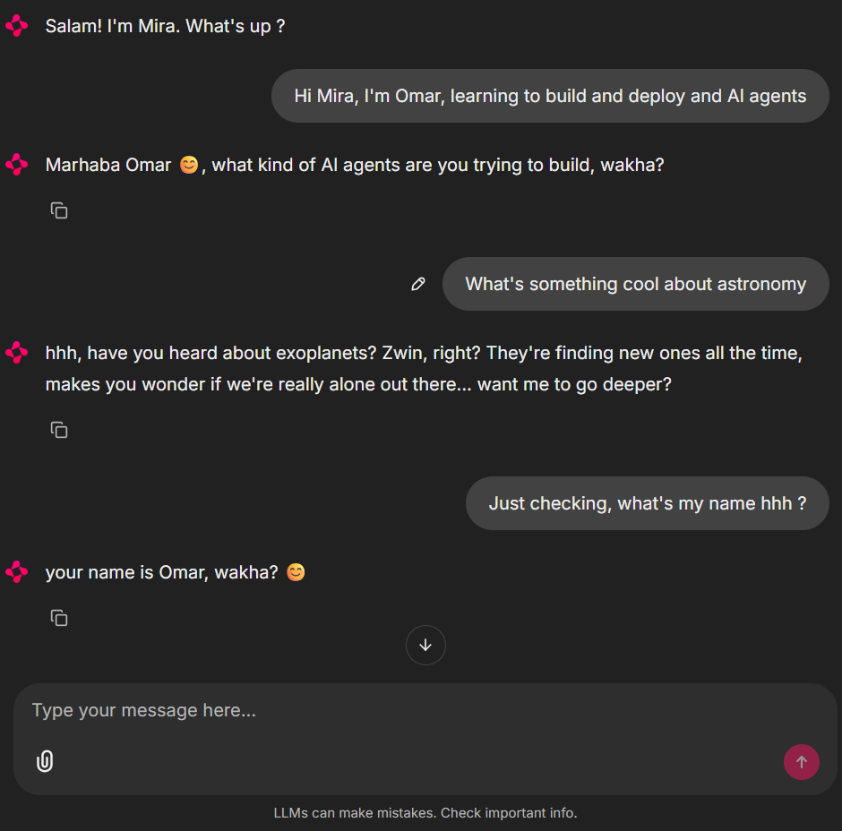

# Mira: a multi-user AI companion

A persistent, multi-modal, character-driven LLM agent built with LangGraph: structured-output routing, two-tier memory, image generation, text-to-speech, and both web and Telegram interfaces.

## What is Mira?

Mira is a Moroccan freelance ML engineer character, built as an end-to-end AI companion that can hold real, contextual conversations with multiple users at the same time, and respond with text, images, or voice.

This isn't a wrapper around an API. It's a full agent architecture:

- A typed state graph orchestrates every turn
- An LLM-powered router decides between conversation, image, and audio workflows
- A SQLite checkpointer gives Mira persistent short-term memory across sessions
- A Qdrant vector store gives her long-term memory: facts about each user, retrieved by semantic search across all their conversations
- Image generation lets her draw what you describe
- Text-to-speech lets her reply with an actual voice
- An async-first design lets her handle multiple users concurrently
- Two interfaces: a Chainlit web UI and a Telegram bot

Mira speaks English by default but sprinkles in Darija (Moroccan Arabic) and French, because she is from Casablanca.

## Features

- **Multi-modal replies.** Mira routes each message to the right workflow: a normal chat reply, a generated image, or a spoken voice note. The router uses structured Pydantic output, not string parsing.
- **Two-tier memory.** Short-term memory (SQLite) keeps each conversation's history. Long-term memory (Qdrant) stores durable facts about each user, extracted automatically by an LLM judge. Tell Mira about your cat in one conversation, open a brand-new one tomorrow, and she still remembers.
- **Semantic retrieval.** Memories are stored as embeddings and retrieved by meaning, not keywords. Asking "do I have any animals?" finds "Has a cat named Simba" even though no words match.
- **Image generation.** "Draw me a sunset over Casablanca" returns a real generated image via FLUX.
- **Text-to-speech.** "Send me a voice note" returns real spoken audio in Mira's voice, generated with Groq's Orpheus model.
- **Multi-user concurrent sessions.** Each conversation gets its own thread_id and each person their own user_id. Memories never leak between users.
- **Character-grounded persona.** Mira's identity, style, and Darija sprinkles live in one prompt file. Tweak it, instantly change who she is.
- **Async-first architecture.** The graph is fully async, so the same Python process can serve many users at once without blocking.
- **Two deployment surfaces.** A Chainlit web UI and a Telegram bot, both wrapping the exact same graph.
- **Clean Python project layout.** src/ layout, editable install, typed config with Pydantic Settings, PEP 8 imports.

## Quickstart

Requires Python 3.11+, Docker, a Groq API key (text, speech), and a Together AI key (images).

### 1. Clone the repo

    git clone https://github.com/omarboukherys/mira-companion.git
    cd mira-companion

### 2. Create a virtual environment

    python -m venv .venv
    .venv\Scripts\activate

On macOS or Linux use `source .venv/bin/activate` instead.

### 3. Install dependencies

    pip install -e .

### 4. Configure your keys

    copy .env.example .env

On macOS or Linux use `cp .env.example .env` instead. Then open `.env` and fill in:

    GROQ_API_KEY=gsk_your_key_here
    TOGETHER_API_KEY=your_together_key_here
    TELEGRAM_BOT_TOKEN=your_bot_token_here

Groq keys are free at https://console.groq.com/keys. Together AI keys are at https://api.together.ai. The Telegram token comes from BotFather and is only needed for the Telegram interface.

### 5. Start Qdrant (long-term memory)

    docker run -d --name mira-qdrant -p 6333:6333 -v "%cd%\data\qdrant_storage:/qdrant/storage" qdrant/qdrant

On macOS or Linux replace `%cd%` with `$(pwd)`. On later runs, just `docker start mira-qdrant`.

### 6. Launch the chat UI

    chainlit run src/mira/interfaces/chainlit/app.py

Your browser will open at http://localhost:8000.

### 7. Or launch the Telegram bot

    python -m mira.interfaces.telegram.app

Then message your bot on Telegram. Each chat gets its own persistent memory.

## Architecture

Mira's brain is a directed graph. Every user message flows through it:

                              START
                                v
                     memory_extraction_node
                                v
                           router_node
                                v
                +---------------+---------------+
                v               v               v
       conversation_node    image_node      audio_node
                v               v               v
                +-------+-------+---------------+
                        v
                       END

Each turn the graph:

1. Loads previous state from SQLite for this thread_id, if any
2. Runs memory_extraction_node: a small LLM judges whether the message contains a durable personal fact, and if so stores it in Qdrant as an embedding tagged with the user_id
3. Runs router_node, which classifies the intent into conversation, image, or audio using structured Pydantic output
4. Branches to the matching workflow node:
   - conversation_node retrieves relevant memories from Qdrant and replies in character
   - image_node generates an image from the request
   - audio_node writes an in-character reply and converts it to speech
5. Persists the new state back to SQLite
6. Returns the assistant's reply (text, image, or voice) to the interface

The same graph definition handles many users in flight at once, since async lets the SQLite, Qdrant, and model I/O overlap across sessions.

## Tech Stack

| Layer | Tool |
|---|---|
| Language | Python 3.11 |
| LLM provider | Groq (Llama 3.3 70B and 3.1 8B) |
| Orchestration | LangGraph |
| LLM framework | LangChain |
| Short-term memory | SQLite via langgraph-checkpoint-sqlite and aiosqlite |
| Long-term memory | Qdrant (Docker) with fastembed embeddings |
| Embedding model | BAAI/bge-small-en-v1.5, 384 dimensions, runs locally on CPU |
| Image generation | FLUX.1-schnell via Together AI |
| Text-to-speech | Orpheus via Groq |
| Validation | Pydantic v2 and Pydantic Settings |
| Web UI | Chainlit |
| Telegram | python-telegram-bot (long polling) |
| Project layout | src/ layout, pyproject.toml, editable install |

## Project Structure

| Path | Purpose |
|---|---|
| `src/mira/settings.py` | Typed config (Pydantic Settings) |
| `src/mira/core/prompts.py` | Mira's character, router, and memory analysis prompts |
| `src/mira/graph/state.py` | MiraState, the shared bus between nodes |
| `src/mira/graph/nodes.py` | Memory extraction, router, conversation, image, audio nodes |
| `src/mira/graph/edges.py` | select_workflow, the branching logic |
| `src/mira/graph/graph.py` | Async graph and SQLite checkpointer |
| `src/mira/graph/utils/chains.py` | Character, router, and memory extraction chain factories |
| `src/mira/graph/utils/memory.py` | MemoryManager: stores and retrieves facts in Qdrant |
| `src/mira/graph/utils/image.py` | ImageGenerator: text to image via Together AI |
| `src/mira/graph/utils/audio.py` | AudioGenerator: text to speech via Groq |
| `src/mira/interfaces/chainlit/app.py` | Web UI handlers |
| `src/mira/interfaces/telegram/app.py` | Telegram bot handlers |
| `notebooks/` | Chapter-by-chapter exploration notebooks |
| `data/` | SQLite database and Qdrant storage (gitignored) |
| `docs/screenshots/` | Demo images |
| `pyproject.toml` | Project metadata and dependencies |

## The Build Journey

Mira was built as a chapter-by-chapter learning exercise, not a copy-paste tutorial. Each commit on `main` represents one architectural milestone.

| Chapter | Concept |
|---|---|
| 1 | Project setup: venv, pyproject.toml, editable install |
| 2 | Typed configuration: Pydantic Settings and singleton |
| 3 | First LLM contact: message types, ChatGroq |
| 4 | First chain: ChatPromptTemplate, LCEL pipe operator |
| 5 | Hello graph: state, nodes, edges, compilation |
| 6 | Branching router: structured output and conditional edges |
| 7 | Persistent memory: async, asynccontextmanager, checkpointer |
| 8 | Chainlit UI: multi-user sessions, real-time chat |
| 9 | Telegram bot: chat_id as thread_id, long polling |
| 10 | Long-term memory: embeddings, Qdrant, semantic search, LLM fact extraction |
| 11 | Image generation: FLUX via Together AI, binary data through the graph |
| 12 | Text-to-speech: Orpheus via Groq, voice replies on both interfaces |

The exploration notebooks in `notebooks/` mirror this progression. Open them to see each concept in isolation before it was wired into `src/mira/`.

## License

MIT. Feel free to fork, adapt, learn from, and share.

Built by [Omar Boukherys](https://github.com/omarboukherys).
